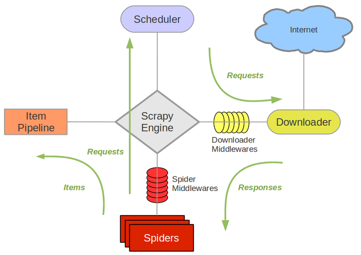
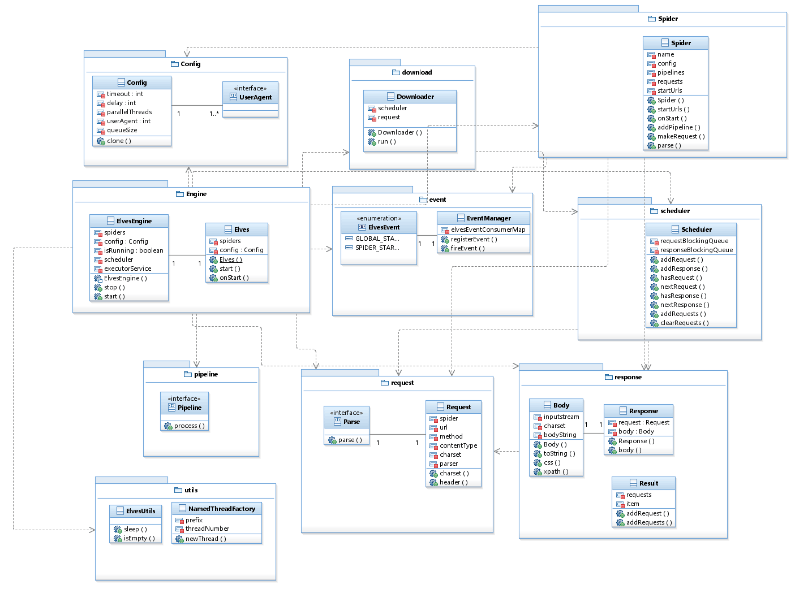

# easyCrawler
基于Scrapy框架思想，使用JAVA设计一款轻量级，多线程易使用的框架

* 框架思想

  我们首先来看一下Scrapy的框架总体设计

  

  * Scrapy Engine: 这是引擎，负责Spiders、ItemPipeline、Downloader、Scheduler中间的通讯，信号、数据传递等等！（像不像人的身体？）
  * Scheduler(调度器): 它负责接受引擎发送过来的requests请求，并按照一定的方式进行整理排列，入队、并等待Scrapy Engine(引擎)来请求时，交给引擎。
  * Downloader（下载器）：负责下载Scrapy Engine(引擎)发送的所有Requests请求，并将其获取到的Responses交还给Scrapy Engine(引擎)，由引擎交给Spiders来处理
  * Spiders：它负责处理所有Responses,从中分析提取数据，获取Item字段需要的数据，并将需要跟进的URL提交给引擎，再次进入Scheduler(调度器)，
  * Item Pipeline：它负责处理Spiders中获取到的Item，并进行处理，比如去重，持久化存储（存数据库，写入文件，总之就是保存数据用的）
  * Downloader Middlewares（下载中间件）：你可以当作是一个可以自定义扩展下载功能的组件
  * Spider Middlewares（Spider中间件）：你可以理解为是一个可以自定扩展和操作引擎和Spiders中间‘通信‘的功能组件（比如进入Spiders的Responses;和从Spiders出去的Requests）

* 我们的类图模型

   

* 包结构

   * config 爬虫的配置包
      * Config 配置鸡肋
      * UserAgent  常见UA配置
   * download 下载器
      * Downloader 下载器线程
   * Engine 爬虫引擎
      * Elves 爬虫主类
      * ElvesEngine 爬虫执行引擎
   * event 事件
      * ElvesEvent 事件枚举（全局事件，爬虫事件）
      * EventManager 观察者模式 事件管理器
   * pipeline 数据处理
      * Pipeline 数据处理接口
   * request 请求包
      * Parser 解析器接口
      * Request 请求封装
   * response 响应包
      * Body 响应Body
      * Response 响应对象
      * Result 响应结果封装
   * scheduler 调度器
      * Scheduler 爬虫调度器
   * Spider 
      * Spider 基于特定网页爬取自己需要的信息
   * utils 工具包
      *  ElvesUtils 线程调度时间等工具
      * NamedThreadFactory 线程名称命名 

   

* 环境要求

  * JDK1.8

  * lombok插件

    